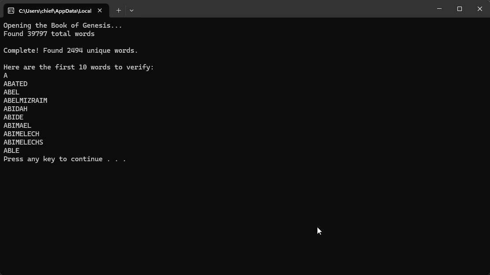

# Genesis Word Processor

A simple Python script that reads the **Book of Genesis** from a text file, extracts all unique words, cleans them (removing punctuation and non-alphabetic characters), and saves the results in a separate file. Great for learning file handling, string processing, and basic list operations in Python.

## Features
    Reads from a plain text file (genesis.txt),
    Splits and processes words from the text,
    Cleans words by removing non-alphabetic characters,
    Converts words to uppercase for uniformity,
    Removes duplicates and sorts the words,
    Saves the unique word list to a new text file (genesis_words.txt),
    Displays a sample of words to verify results.

## How to Run

1. Make sure you have Python installed (version 3.x recommended).
2. Place the `genesis.txt` file in the same directory as the script.
3. Run the script using:

    Genesis Alphabetizer.sln

4. After execution, check the output file `genesis_words.txt` for the cleaned list of unique words.

## Sample Output (Console)

> 📁 Make sure `genesis.txt` is in the same folder as your script.

